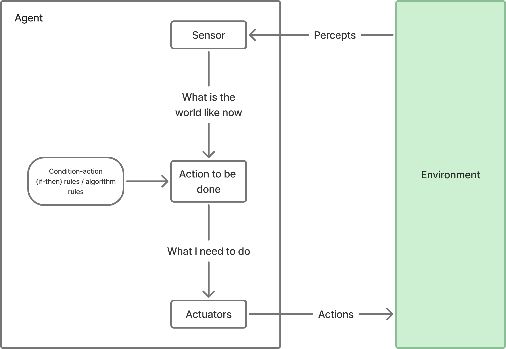

  
    Antoine Sutter & Tanguy Cavagna
     
    May 23, 2025
  

  <h1>Multi-Agents System</h1>
  
How collective intelligence emerges from individual behaviors

  Image by <a href="//commons.wikimedia.org/wiki/User:SmallRex" title="User:SmallRex">SmallRex</a> - Own work, <a href="https://creativecommons.org/licenses/by-sa/4.0" title="Creative Commons Attribution-Share Alike 4.0">CC BY-SA 4.0</a>, <a href="https://commons.wikimedia.org/w/index.php?curid=99796204">Link</a>

---
level: 2
---

# Introduction

## What Are Multi-Agent Systems (MAS)?

- A collection of automonous, interacting agents placed in a shared environment.
- Each agent perceive, reason, act, and sometimes communicate with others.
- Emergent behavior exhibition from local interactions.

## Why Are MAS Important?

- They model distributed, decentralized systems that are scalable and robust.
- Inspired by physical and biological systems and applied to various fields.

---

# Abstract Modeling
*Simple reflex agent*

Diagram taken from wikipedia - "Multi-agent system", redrawn by us.

---

# Mathematical Modeling

<v-click hide>
Fromally, a MAS can be defined as:

$$
MAS = \langle A, E, I, \gamma \rangle
$$

where:
- $A = \{a_1, a_2, \dots, a_n\}$ is a finite set of agents
- $E$ represents the environment
- $I = \{i_1, i_2, \dots, i_n\}$ is a set of interaction
- $\gamma : A \times E \times I \rightarrow A \times E$ is a transition function
</v-click>

<v-click at="1">
awdawd
</v-click>

---
transition: null
---

 Visible after 1 click 

 Hidden after 2 clicks 

 Hidden after 2 clicks 

---

<BacteriaPlot />
