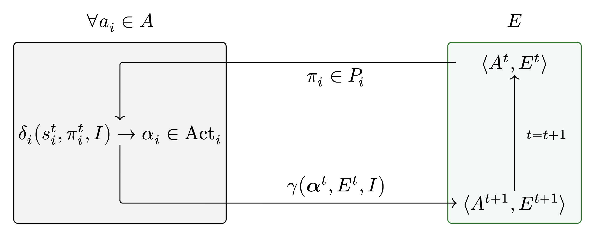

  
    Antoine Sutter & Tanguy Cavagna
     
    May 23, 2025
  

  <h1>Multi-Agents System</h1>
  
How collective intelligence emerges from individual behaviors

  Image by <a href="//commons.wikimedia.org/wiki/User:SmallRex" title="User:SmallRex">SmallRex</a> - Own work, <a href="https://creativecommons.org/licenses/by-sa/4.0" title="Creative Commons Attribution-Share Alike 4.0">CC BY-SA 4.0</a>, <a href="https://commons.wikimedia.org/w/index.php?curid=99796204">Link</a>

---
transition: slide-left
---

# Introduction

## What Are Multi-Agent Systems (MAS)?

- A collection of automonous, interacting agents placed in a shared environment.
- Each agent perceive, reason, act, and sometimes communicate with others.
- Emergent behavior exhibition from local interactions.

## Why Are MAS Important?

- They model distributed, decentralized systems that are scalable and robust.
- Inspired by physical and biological systems and applied to various fields.

<Arrow v-click.at="3" x1="600" y1="270" x2="540" y2="225" color="#facc15" />

Like stigmergy, repulsion/attraction

---
transition: none
---

# Mathematical Modeling

Each agent $a_i \in A$ is typically modeled as:

$$
  a_i = \langle S_i, P_i, Act_i, \delta_i \rangle
$$

where:
- $S_i$ is the set of internal states
- $P_i$ is the perception function mapping environment states to perceived information
- $Act_i$ is the set of possible actions
- $I = \{i_1, i_2, \dots, i_n\}$ is a set of possible interaction
- $\delta_i: S_i \times P_i(E) \times I \rightarrow \alpha_i \in Act_i$ is the decision function (micro/agent level)

---
transition: none
---

# Mathematical Modeling

Fromally, a $MAS$ can be defined as:

$$
MAS = \langle A, E, I, \gamma \rangle
$$

where:
- $A = \{a_1, a_2, \dots, a_n\}$ is a finite set of agents
- $E$ represents the environment
- $\gamma : \boldsymbol{\alpha}^t \times E^t \times I \rightarrow A^{t+1} \times E^{t+1}$ is the global transition function (macro/system level)

---
transition: slide-left
---

# Mathematical Modeling

At each discrete time step $t$, the system evolves as:

$$ {all|1|2|3}
\begin{aligned}
\pi^t_i &= P_i(E^t) \\
\alpha_i^t &= \delta_i(s_i^t, \pi^t_i, I),\ \text{where} \ s^t_i \in S_i\\
\langle A^{t+1}, E^{t+1} \rangle &= \gamma(\boldsymbol{\alpha}^t, E^t, I),\ \text{where}\ \boldsymbol{\alpha}^t = \{\alpha_1^t, \dots, \alpha_n^t\}
\end{aligned}
$$

<v-click at="1"><strong>1. Perception</strong>: Each agent perceives the environment</v-click>  
<v-click at="2"><strong>2. Decision</strong>: Based on its internal state, its perception, and the set of interactions, the agent chooses and action</v-click>  
<v-click at="3"><strong>3. Global Transition</strong>: All chosen actions, together with the environment and interactions, determine the next global system state</v-click>

---
transition: slide-left
---

# Abstract Modeling

---
transition: fade-out
---

<BacteriaPlot />
